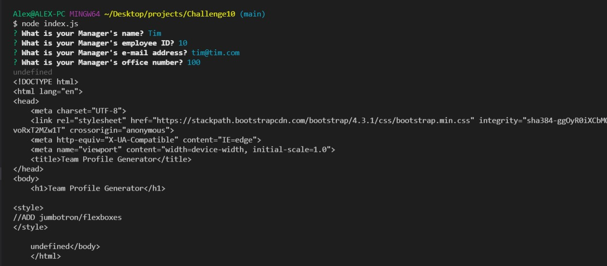
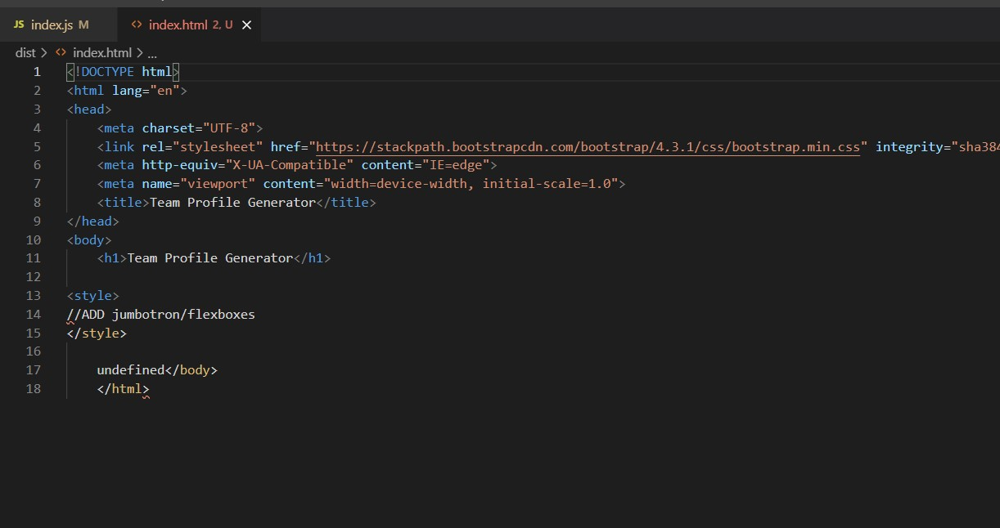

# Challenge 10 - Team Profile Generator

## Purpose
To quickly create a Team Profile from the command line using Node and Inquirer and OOD concepts.

## Built With
* JavaScript
* Inquirer
* JSON
* Node
* HTML
* Bootstrap
* Jest

## Requirements/Notes
* AS A manager
* I WANT to generate a webpage that displays my team's basic info
* SO THAT I have quick access to their emails and GitHub profiles

## Testing
* 

## Video Link
https://drive.google.com/file/d/1kEQXm3tJqW2iNUYJzsDm78CMiAphOUI1/view
## Github Link
https://christenson10.github.io/challenge10/

## Pictures

## README Preview 1

## README Preview 2
