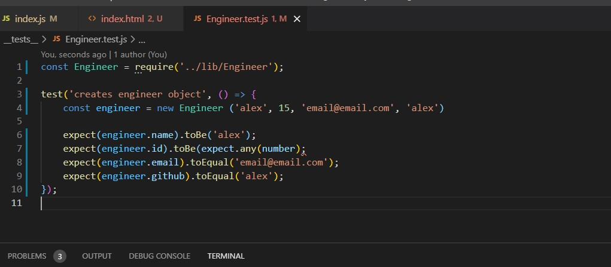

# Challenge 10 - Team Profile Generator

## Purpose
To quickly create a Team Profile from the command line using Node and Inquirer and OOD concepts.

## Built With
* JavaScript
* Inquirer
* JSON
* Node
* HTML
* Bootstrap
* Jest

## Requirements/Notes
* AS A manager
* I WANT to generate a webpage that displays my team's basic info
* SO THAT I have quick access to their emails and GitHub profiles

## Testing
* The Jest package was used for JavaScript testing.

## Video Link
https://drive.google.com/file/d/13KRGKweQjoUwuZ9AIWDQ08ezbch6fRVR/view
## Github Link
https://christenson10.github.io/challenge10/

## Pictures

## README Preview 1
Command line question and creation of HTML file

## README Preview 2
HTML file

## README Preview 3
Engineer Test Example

